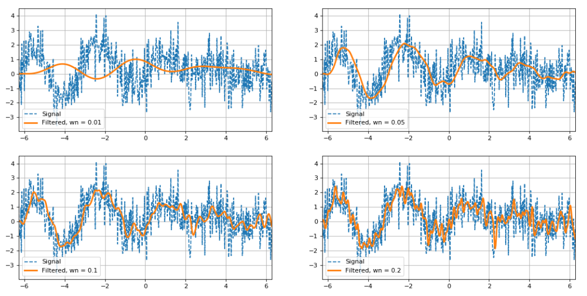

# Digital signal processing using python
In this repository you'll find useful Python DSP scripts.

These can be used as a refrence when implementing the algorithms in FPGA/SoC applications.

### List of components:

| Script | Function| Description |
|----------|----------|----------|
|[fft.py](URL)  | FFT   | Convert a signal from time domain to frequency domain  |
| [fir.py](URL) | FIR | Used for filtering and processing digital signals |
| [cfir.py](URL)    | CFIR   |   Used for filtering and processing complex signals  |
| [cic.py](URL)   | CIC   |  Used for decimation and interpolation(Commonly used in applications like digital audio processing)  |
|[maf.py](URL)   | MAF   |  Moving Average Filter   |
|[sg.py](URL)    | SG  |   Signal generator module : sine or cosine / AM, FM modulation /Chirp modulation / Gauss white noise  |
| [calc.py](URL) | CALC | calculate : energy of sequence; power of sequence; root mean square; root mean square; AmpLevel-[dB] conversion|
